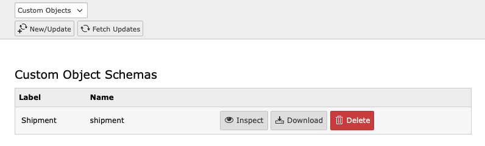

.. include:: /Includes.txt

.. _backend:

==============
Backend Module
==============

The hubspot extensions provides a backend module for administrators. You can
find it in the module menu at :guilabel:`Admin Tools > Hubspot Integration`.

The backend module contains three sub modules:

Forms
   Lists the pages and content elements that contain Hubspot forms. You can
   switch to the content element itself or edit the form in Hubspot.
CTAs
   Lists the pages and content elements that contain Hubspot CTAs. You can
   switch to the content element itself or edit the CTA in Hubspot.
Custom objects
   Management interface for custom object schemas. This is where you add and
   synchronize custom object schemas between your code, TYPO3's database, and
   whichever Hubspot account is connected to your deployed TYPO3 instance
   (e.g. sandbox or live).

.. _backend-custom-objects:

Custom Objects
==============

.. important::
   A custom object schema must exist and be up-to-date in TYPO3 in order for
   custom object synchronization to work.

.. _backend-custom-objects-ui:

User interface
--------------

   The main interface lists custom object schemas, i.e. definitions of custom
   objects.

.. _backend-custom-objects-docheader:

Docheader buttons
~~~~~~~~~~~~~~~~~

New
   Create or update a new custom object schema from a JSON file.
Fetch Updates
   Fetch custom object schemas and updates to these from Hubspot.

.. _backend-custom-objects-list:

Custom Object schema list buttons
~~~~~~~~~~~~~~~~~~~~~~~~~~~~~~~~~

Inspect
   View the schema configuration tree.
Download
   Download a schema as a JSON file.
Delete
   Delete a schema (effectively archiving it). This can only be done if no
   custom objects using this schema exists.

.. important::
   Clicking the delete button on a schema in the list does not perform the
   *purge* operation that is necessary to remove the schema entirely. A purge is
   necessary if you would like to recreate schema with the same name. Please
   refer to the `Hubsubspot API documentation<https://developers.hubspot.com/docs/api/crm/crm-custom-objects>`__
   for the `DELETE /crm/v3/schemas/{objectType}/purge` endpoint.

.. _backend-custom-objects-declare:

Declaring a schema definition file
----------------------------------

When clicking the :guilabel:`New` button in the docheader, you will be brought
to a list of *declared* schema files. These are JSON files within your code
repository. You can use these files to create or update a custom object in
Hubspot.

Keeping your schemas in with your code enables you to have schema definitions
under versioning and ensure that you are using exactly the same schema in
different Hubspot accounts (e.g. sandbox or live).

In order to appear in the list the JSON file must be declared in an extension's
:file:`ext_tables.php` file:

.. code-block:: php

   \T3G\Hubspot\Utility\CustomObjectUtility::addSchemaDefinitionFile(
       'EXT:my_theme/Configuration/Hubspot/CustomObjectSchemas/MySchema.json'
   );

.. info::

   The content of the JSON file should be the same as the data portion of a
   *create* operation on the Hubspot API. Check out the `POST /crm/v3/schemas`
   endpoint in Hubspot's `custom object API documentation<https://developers.hubspot.com/docs/api/crm/crm-custom-objects>`__.

   .. code-block:: json

      {
        "name": "my_object",
        "labels": {
          "singular": "My object",
          "plural": "My objects"
        },
        "primaryDisplayProperty": "my_object_property",
        "requiredProperties": [
          "my_object_property"
        ],
        "properties": [
          {
            "name": "my_object_property",
            "label": "My object property",
            "isPrimaryDisplayLabel": true
          }
        ],
        "associatedObjects": [
          "CONTACT"
        ],
        "metaType": "PORTAL_SPECIFIC"
      }

   Details about the property configurations are available in
   Hubspot's `Properties API documentation<https://developers.hubspot.com/docs/api/crm/properties>`__.
