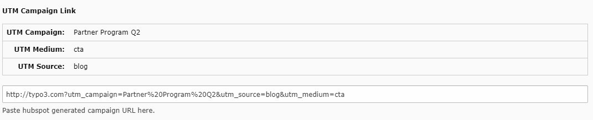

Hubspot for Editors
===================

Hubspot provides you with many possibilities to create forms, which can be
integrated into your website. The integration of these forms usually happens
when a specific Javascript code snippet is added to your website. The
Hubspot extension simplifies this task. After the extension is successfully
installed and configured, every TYPO3 editor is able to select existing
Hubspot forms and add them to the website. The forms are automatically
rendered by the Hubspot Javascript framework and added to the site.

For this how-to we are assuming that you are already comfortable working with
TYPO3 as an editor and know your way around the TYPO3 backend.

Add Forms
---------

Adding forms is exactly like adding any other content element on a page. You
have to click on the "Create new content element" button and go to the
"Form elements" tab. Here you can select "Hubspot Form". In the properties of
the content element, choose from a list of all active Hubspot forms, which have
previously been created in Hubspot.

Provide Campaign Information on pages
-------------------------------------

If you have pages in your TYPO3 installation that belong to special campaigns
you may want to automatically add hubspot tracking information to every link to
that page. For example you may have blog posts associated with a campaign.

To add campaign information to a page first generate a campaign link in hubspot.
Go to "Campaigns", choose the corresponding campaign, click "Create tracking url".
Copy the full tracking url to the clipboard.

In TYPO3 open the page properties of your campaign page and go to the tab `hubspot`.
Paste the full tracking link and click save. The tab should now show the extracted
campaign data. Every link generated through the normal TYPO3 link handling to this
page will now contain these parameters.

